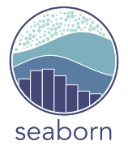

<h1 align="center">👋 Hello! I'm Olivier</h1>
<h3 align="center">A Developer with a passion for data and web accessibility</h3>

  
About me : Motivated software developer with 5+ years of experience in managing products for multinational technology companies. Passionate about building solution that fix problems. Relevant skills include machine learning, problem solving, programming, and creative thinking. 
  

🔭 I’m currently working on [a new project]

🌱 I’m currently learning **React**

🎯 All of my projects are available at : [Portfolio](https://olivierlpp.github.io/) (Under Construction)

💬 Ask me **why I became a developer!**

📫 The best way to reach me is at **o.lepestipon@gmail.com**

⚡ Fun fact **I love corgies 🐶**

<h3 align="left">Connect with me:</h3>

<h3 align="left">Languages and Tools:</h3>

 
 

 
 
 
 
 

  

- :office: Connect with me on [LinkedIn](https://www.linkedin.com/in/olivierlepestipon/)

